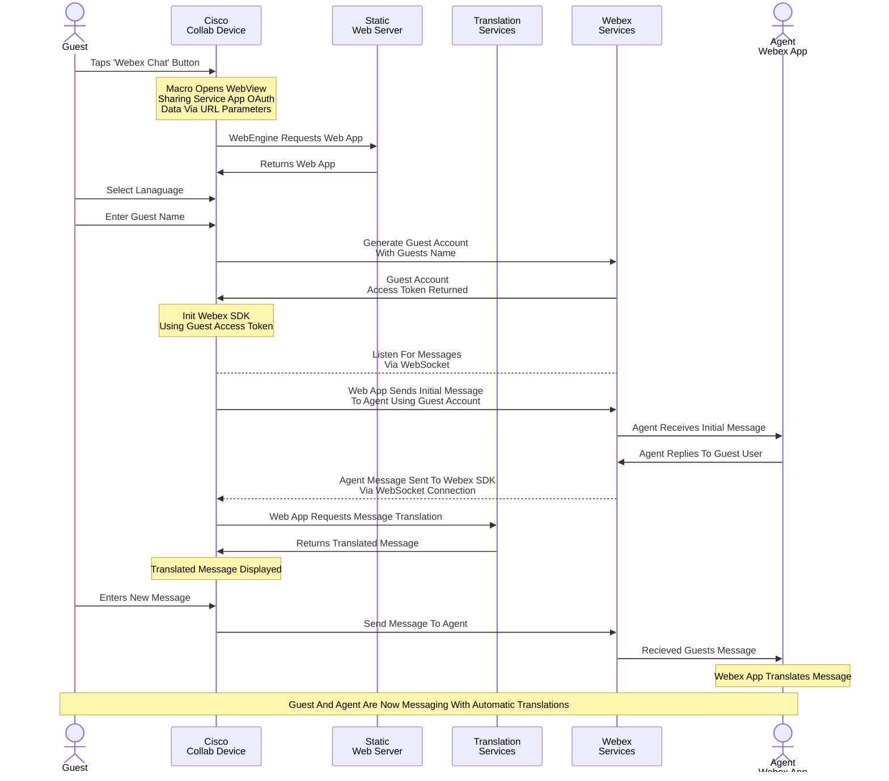

# Translation Guest Chat Web App and Macro

This is an example Cisco Collaboration Device Macro and Web App which enables a guest user to IM with a Webex User with automatic translation.


## Overview

### Cisco Collaboration Device Macro:

This macros stores Webex Service App Guest Issuer OAuth Credentials and also saves a UI Extension Button to the Device. When a Guest User taps on the button, the macro generates an Access Token using the Service App credentials and then opens the Chat Web App as a WebView while also sharing the Access Token and Target Agents Email address to the Web App using URL hash parameters.

### Chat Web App:

This is a Single Page Application Web App which can be hosted on any Static Web Server and no backend is required. All configuration details which the Web App requires to function are shared to it via URL hash parameters when launched by the macro above. The Web App has three states:

* Language Selection
* Name Input
* Chat Session


### Flow Diagram




## Setup

### Prerequisites & Dependencies: 

- Webex Service App Integration with Guest Issuer scopes
    - Scopes: ``guest-issuer:write`` & ``guest-issuer:read``
    - Additional Documentation: https://developer.webex.com/docs/sa-guest-management
- Cisco Collaboration Desk or Board Device with RoomOS 11.x or above
- Web admin access to the device to upload the macro
- (optional) Web Server to host your own copy of the Chat Web App


### Installation Steps:

1. Download the ``translation-guest-chat.js`` file and upload it to your Webex Devices Macro editor via the web interface.
2. Configure the macro, by entering the Client ID/Secret and Refresh Token of your Service App. Also configured the Target Email of the Webex Agent the Web App will automatically contact.
    ```javascript
    const config = {
      webapp: 'https://wxsd-sales.github.io/translation-guest-chat-webapp-macro/webapp',
      oauth: {
        clientId: '<Guest Management Service App Client ID>',
        clientSecret: '<Guest Management Service App Client Secret>',
        refreshToken: '<Guest Management Service App Refresh Token>'
      },
      target: '<Email Address Of Target Agent>',
      panelId: 'webexchat'
    }
    ```
4. Save and Enable the Macro on the editor.

## Demo

*For more demos & PoCs like this, check out our [Webex Labs site](https://collabtoolbox.cisco.com/webex-labs).

## License

All contents are licensed under the MIT license. Please see [license](LICENSE) for details.


## Disclaimer
<!-- Keep the following here -->  
Everything included is for demo and Proof of Concept purposes only. Use of the site is solely at your own risk. This site may contain links to third party content, which we do not warrant, endorse, or assume liability for. These demos are for Cisco Webex usecases, but are not Official Cisco Webex Branded demos.


## Questions
Please contact the WXSD team at [wxsd@external.cisco.com](mailto:wxsd@external.cisco.com?subject=translation-guest-chat-webapp-macro) for questions. Or, if you're a Cisco internal employee, reach out to us on the Webex App via our bot (globalexpert@webex.bot). In the "Engagement Type" field, choose the "API/SDK Proof of Concept Integration Development" option to make sure you reach our team. 
